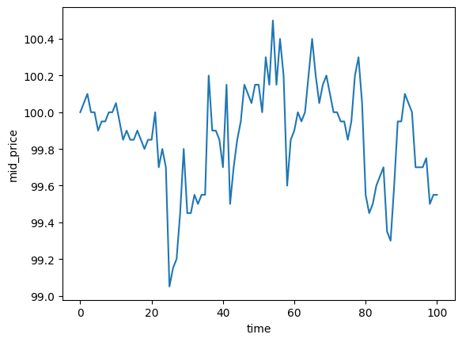

# Limit-Order Book Model Simulation
This repository was created to reproduce the content of the following article.

https://q-squared-technologies.notion.site/Emerging-Float-LOB-Model-ed98c622b52d48969ed69ac00e957ac0

## How does it work?
Number of limit order, cancel order, market long order, market short order

$$\lambda_i^L(t) = \mu_i^L$$
$$\lambda_i^C(t) = \mu_i^C$$
$$\lambda^{M_l}(t) = \mu^{M_l}$$
$$\lambda^{M_s}(t) = \mu^{M_s}$$

Amount of limit order, cancel order, market long order, market short order

$$\lambda_i^L(t) = u \times (1 + \xi_i^L)$$
$$\lambda_i^C(t) = u \times (1 + \xi_i^C)$$
$$\lambda^{M_l}(t) = u \times (1 + \xi^{M_l})$$
$$\lambda^{M_s}(t) = u \times (1 + \xi^{M_s})$$

where

- $i$: order of quote
- $t$: time
- $u$: unit
- each $\mu \sim Poisson$
- each $\xi \sim Poisson$

If this is executed, the simulation result will be returned.

```
python -m lob_simulation
```


## simulation result
The simulation result example (default parameter)


